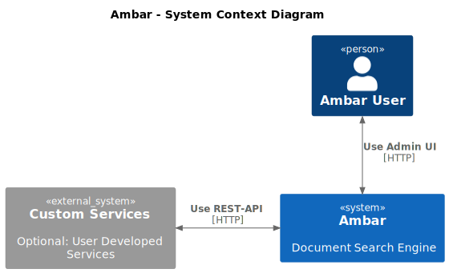
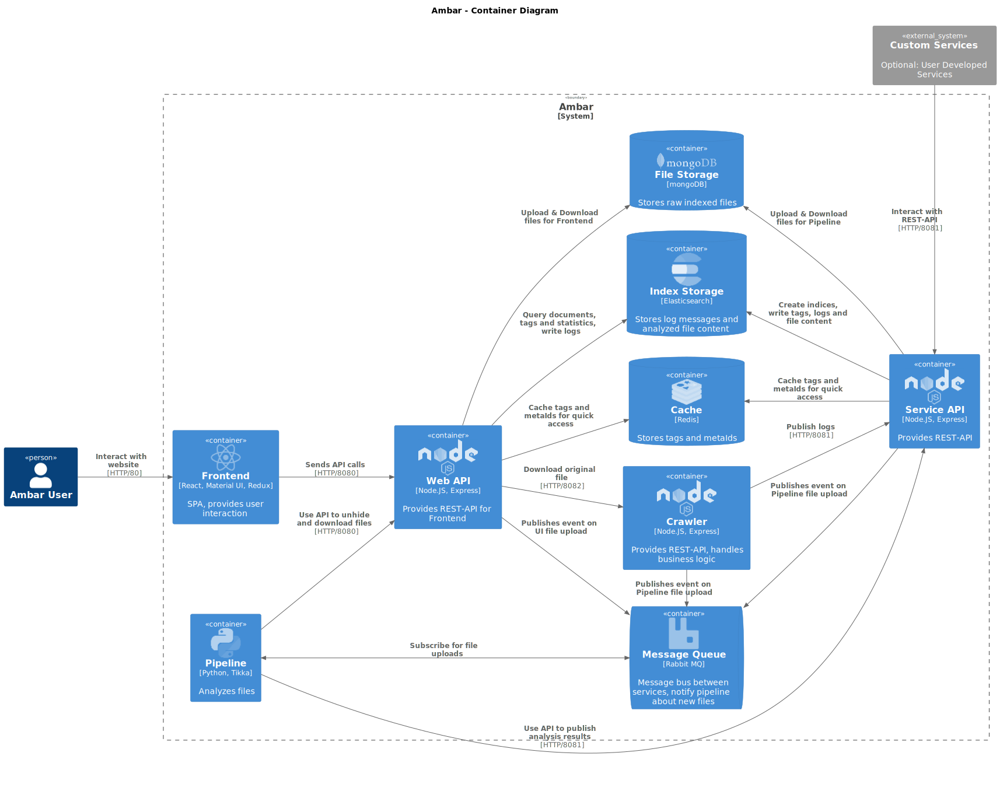

[](./License.txt)

:mag: Ambar: Document Search Engine
================================
_A fork of [RD17/Ambar](https://github.com/RD17/ambar) with various fixes and upgrades_


Ambar is an open-source document search engine with automated crawling, OCR, tagging and instant full-text search.

Ambar defines a new way to implement full-text document search into your workflow.

- Easily deploy Ambar with a single `docker-compose` file
- Perform Google-like search through your documents and contents of your images
- Tag your documents
- Use a simple REST API to integrate Ambar into your workflow

## Features

### Search

[Tutorial: Mastering Ambar Search Queries](https://ambar.cloud/blog/2017/03/24/mastering-search-queries/)

- Fuzzy Search (John~3)
- Phrase Search ("John Smith")
- Search By Author (author:John)
- Search By File Path (filename:\*.txt)
- Search By Date (when: yesterday, today, lastweek, etc)
- Search By Size (size>1M)
- Search By Tags (tags:ocr)
- Search As You Type
- Supported language analyzers: English `ambar_en`, Russian `ambar_ru`, German `ambar_de`, Italian `ambar_it`, Polish `ambar_pl`, Chinese `ambar_cn`, CJK `ambar_cjk`

### Crawling

Ambar only supports local fs crawling, if you need to crawl an SMB share of an FTP location - just mount it using standard linux tools.
Crawling is automatic, no schedule is needed due to crawlers monitor file system events and automatically process new, changed and removed files.

### Content Extraction

**Ambar supports large files (>30MB)**

Supported file types:

- ZIP archives
- Mail archives (PST)
- MS Office documents (Word, Excel, Powerpoint, Visio, Publisher)
- OCR over images
- Email messages with attachments
- Adobe PDF (with OCR)
- OCR languages: Eng, Deu, Fra, Por
- OpenOffice documents
- RTF, Plaintext
- HTML / XHTML
- Multithread processing

## Build & Run

**Notice**: Ambar requires Docker to run

If you want to see how Ambar works w/o installing it, try our [live demo](https://app.ambar.cloud/). No signup required.

All the images required to run Ambar can be built locally. In general, each image can be built by navigating into the directory of the component in question, performing the compilation steps required and building the image like that:

```shell
# From project root
docker compose up --build
```

## Architecture




Hint: Run plantuml to generate the updated PNG (or an online tool like [PlantText](https://www.planttext.com/)).

## FAQ
### Is it open-source?
Yes, it's fully open-source.

### Is it free?
Yes, it is forever free and open-source.

### Does it perform OCR?
Yes, it performs OCR on images (jpg, tiff, bmp, etc) and PDF's. OCR is perfomed by well-known open-source library Tesseract. We tuned it to achieve best perfomance and quality on scanned documents. You can easily find all files on which OCR was perfomed with `tags:ocr` query

### Which languages are supported for OCR?
Supported languages: Eng, Rus, Ita, Deu, Fra, Spa, Pl, Nld.
See [this commit](https://github.com/Yavari/ambar/commit/0dd5e0edba8b32e283659ae32fff3246048a6740) for an example how to add new languages.

### Does it support tagging?
Yes!

### What about searching in PDF?
Yes, it can search through any PDF, even badly encoded or with scans inside. We did our best to make search over any kind of pdf document smooth.

### What is the maximum file size it can handle?
It's limited by amount of RAM on your machine, typically it's 500MB. It's an awesome result, as typical document managment systems offer 30MB maximum file size to be processed.

## Privacy Policy
[Privacy Policy](./privacy-policy.md)

## License
[MIT License](./License.txt)
